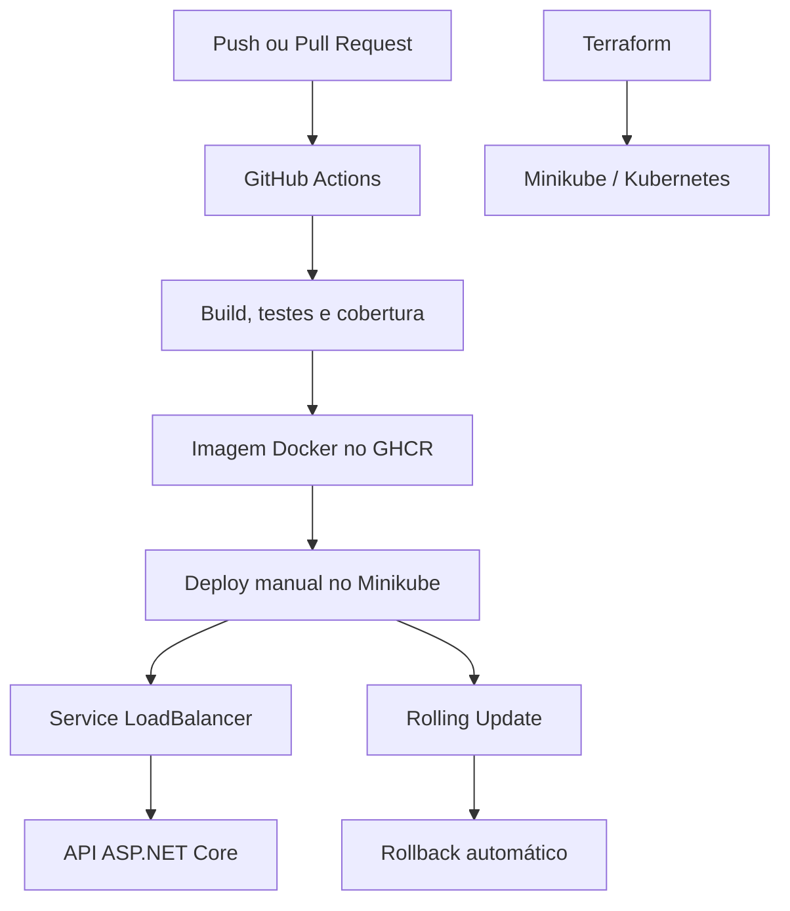

# Azure DevOps Lab — CI/CD, Docker, Kubernetes e Terraform

[](https://github.com/JoaoHLemes/azure-devops-lab/actions/workflows/ci.yml)

Laboratório prático de DevOps utilizando uma API ASP.NET Core, testes automatizados, GitHub Actions, Docker, GitHub Container Registry, Kubernetes com Minikube e infraestrutura como código com Terraform.

O projeto simula um fluxo completo de integração e entrega contínuas, desde a validação do código até o deploy com Rolling Update e rollback automático.

## Objetivos

- Desenvolver e testar uma API em .NET;
- criar uma pipeline de CI/CD como código;
- gerar e validar cobertura de testes;
- construir e publicar imagens Docker;
- implantar a aplicação no Kubernetes;
- configurar probes, recursos e escalabilidade automática;
- utilizar ConfigMaps e Secrets;
- automatizar infraestrutura com Terraform;
- praticar importação e gerenciamento de recursos existentes.

## Arquitetura



## Tecnologias

- .NET 10;
- ASP.NET Core Web API;
- xUnit;
- ReportGenerator;
- Git e GitHub;
- GitHub Actions;
- Docker e Docker Buildx;
- GitHub Container Registry;
- Kubernetes;
- Minikube;
- Terraform;
- PowerShell;
- YAML e HCL.

## Estrutura do projeto

```text
azure-devops-lab/
├── .github/
│   └── workflows/
│       └── ci.yml
├── k8s/
│   ├── configmap.yml
│   ├── deployment.yml
│   ├── hpa.yml
│   └── service.yml
├── scripts/
│   └── check-coverage.ps1
├── src/
│   └── DevOps.Api/
├── tests/
│   └── DevOps.Api.Tests/
├── terraform/
│   ├── kubernetes.tf
│   └── main.tf
├── coverage.runsettings
├── Dockerfile
└── DevOpsLab.slnx
```

## API

A API disponibiliza um endpoint para somar dois números:

```http
GET /api/calculadora/somar?primeiroNumero=30&segundoNumero=12
```

Resposta:

```json
{
  "primeiroNumero": 30,
  "segundoNumero": 12,
  "resultado": 42
}
```

Endpoint utilizado pelas probes do Kubernetes:

```http
GET /health
```

## Executar localmente

### Pré-requisitos

- .NET SDK 10;
- Git;
- Docker Desktop;
- Minikube;
- kubectl;
- Terraform 1.16 ou superior.

### Restaurar, compilar e testar

```powershell
dotnet restore
dotnet build
dotnet test
```

### Executar a API

```powershell
dotnet run --project src/DevOps.Api
```

A porta local é exibida no terminal durante a inicialização.

## Testes e cobertura

O projeto possui testes unitários e testes de integração.

Executar os testes com cobertura:

```powershell
dotnet test DevOpsLab.slnx `
  --configuration Release `
  --collect:"XPlat Code Coverage" `
  --settings coverage.runsettings `
  --results-directory TestResults
```

Gerar o relatório HTML:

```powershell
dotnet tool restore

dotnet reportgenerator `
  "-reports:TestResults/**/coverage.cobertura.xml" `
  "-targetdir:TestResults/CoverageReport" `
  "-reporttypes:Html;TextSummary"
```

Abrir o relatório:

```powershell
Start-Process .\TestResults\CoverageReport\index.html
```

O pipeline exige cobertura mínima de 70%. No estado atual do laboratório, as classes da aplicação atingem 100% de cobertura.

## Docker

Construir a imagem:

```powershell
docker build -t devops-api:1.0 .
```

Executar o contêiner:

```powershell
docker run `
  --name devops-api-container `
  -p 8080:8080 `
  devops-api:1.0
```

Testar:

```text
http://localhost:8080/api/calculadora/somar?primeiroNumero=30&segundoNumero=12
```

Parar e remover:

```powershell
docker stop devops-api-container
docker rm devops-api-container
```

A imagem produzida pelo pipeline é publicada em:

```text
ghcr.io/joaohlemes/devops-api
```

## Pipeline CI/CD

O workflow executa:

1. checkout do repositório;
2. instalação do .NET;
3. restauração das dependências;
4. verificação da formatação;
5. compilação;
6. testes unitários e de integração;
7. geração do relatório de cobertura;
8. validação do limite mínimo de 70%;
9. publicação dos resultados como artefato;
10. construção da imagem Docker;
11. publicação no GHCR;
12. validação do Terraform;
13. deploy manual no Minikube;
14. Rolling Update;
15. rollback automático em caso de falha.

O deploy utiliza um runner self-hosted no Windows porque o cluster Minikube está disponível localmente.

## Kubernetes

Criar ou iniciar o cluster:

```powershell
minikube start
```

Aplicar os manifests:

```powershell
minikube kubectl -- apply -f k8s/configmap.yml
minikube kubectl -- apply -f k8s/service.yml
minikube kubectl -- apply -f k8s/deployment.yml
minikube kubectl -- apply -f k8s/hpa.yml
```

Verificar os recursos:

```powershell
minikube kubectl -- get all -n devops-lab
minikube kubectl -- get hpa -n devops-lab
```

### Disponibilizar a aplicação

O Service utiliza `LoadBalancer`. Em outro PowerShell, executado como administrador:

```powershell
minikube tunnel
```

A aplicação fica disponível em:

```text
http://127.0.0.1/api/calculadora/somar?primeiroNumero=30&segundoNumero=12
```

O terminal do túnel deve permanecer aberto.

### Recursos configurados

- duas réplicas iniciais;
- Rolling Update sem indisponibilidade;
- readiness probe em `/health`;
- liveness probe em `/health`;
- requests e limits de CPU e memória;
- HPA entre 2 e 5 pods;
- ConfigMap para configurações comuns;
- Secrets para informações sensíveis;
- Service do tipo LoadBalancer.

## Terraform

O Terraform utiliza os providers:

- `hashicorp/local`;
- `hashicorp/kubernetes`.

Inicializar:

```powershell
Set-Location terraform
terraform init
```

Formatar e validar:

```powershell
terraform fmt
terraform validate
```

Visualizar as alterações:

```powershell
terraform plan
```

Aplicar:

```powershell
terraform apply
```

Ver os recursos gerenciados:

```powershell
terraform state list
```

O laboratório também demonstra a importação de um namespace Kubernetes existente para o estado do Terraform.

## Segurança

Este repositório não armazena valores sensíveis.

Os seguintes elementos são mantidos fora do Git:

- tokens do GitHub;
- credenciais do GHCR;
- Kubernetes Secrets;
- `terraform.tfstate`;
- planos `.tfplan`;
- relatórios locais de cobertura;
- diretório `.terraform`.

Os Secrets `ghcr-secret` e `devops-api-secret` devem ser criados diretamente no cluster antes do deploy.

## Comandos de inicialização

```powershell
# Terminal 1
minikube start

# Terminal 2 — como administrador
minikube tunnel

# Terminal 3 — runner self-hosted
Set-Location C:\actions-runner
.\run.cmd
```

## Comandos de parada

```powershell
# Encerrar o tunnel e o runner
Ctrl+C

# Parar o Minikube
minikube stop

# Parar o contêiner local, se estiver ativo
docker stop devops-api-container
```

## Autor

**João Henrique Lemes Costa**

- GitHub: [JoaoHLemes](https://github.com/JoaoHLemes)
- LinkedIn: [João Lemes](https://www.linkedin.com/in/joao-lemes-6978131ba)

## Status

Projeto desenvolvido para estudo prático de DevOps, CI/CD, containers, Kubernetes e Infraestrutura como Código.